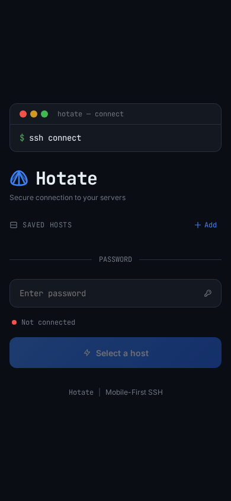
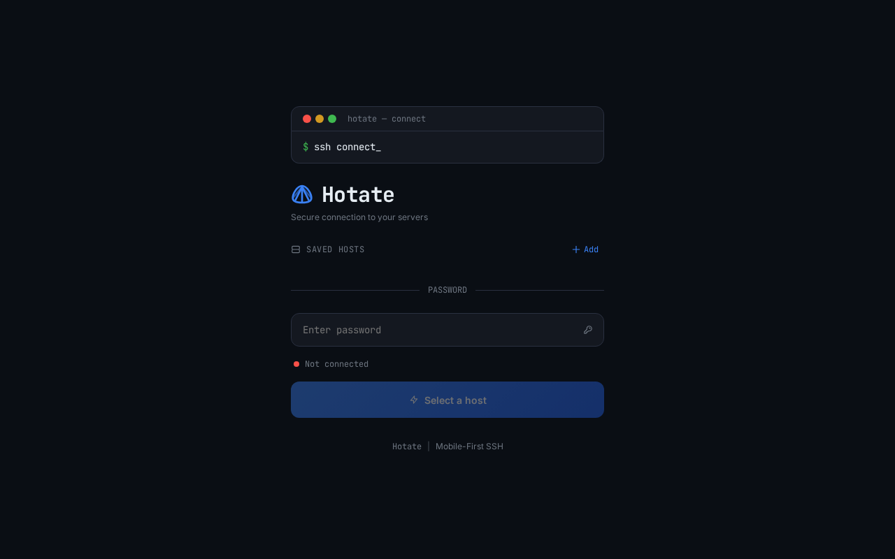

# Hotate

[日本語](README.ja.md) | English

A browser-based SSH client with IME-aware Japanese input, designed for mobile devices.

## Features

- **IME-aware Japanese input** -- Tracks composition via `compositionstart/end`, sends only after commit
- **xterm.js terminal** -- 256 colors, 5000-line scrollback, JetBrains Mono font
- **Special key toolbar** -- Tab, Ctrl+C/D/Z/L, arrow keys, Esc via touch
- **Host management** -- Add, edit, and delete SSH connection profiles (password / SSH key auth)
- **Touch support** -- Scroll and text selection on mobile
- **Copy & paste** -- Auto-copy on selection, right-click menu, clipboard integration
- **tmux integration** -- Auto-detects `tmux attach`, switch/detach via window tab bar
- **Basic auth** -- Set username/password via environment variables
- **No build step** -- Vanilla JS + CDN. Edit and reload

## Screenshots

| Mobile | Desktop |
|:---:|:---:|
|  |  |

## Quick Start

```bash
cp .env.example .env
# Edit .env to set HOTATE_USER / HOTATE_PASS

# Standalone (direct port exposure)
docker compose -f docker-compose.standalone.yml up -d

# Via Traefik reverse proxy
docker compose up -d
```

Access via `http://localhost:3000` (standalone) or your configured domain.

PWA install/offline support is currently disabled while the cache strategy is being reworked.

## Environment Variables

| Variable | Default | Description |
|----------|---------|-------------|
| `HOTATE_USER` | `admin` | Basic auth username |
| `HOTATE_PASS` | `changeme` | Basic auth password |
| `PORT` | `3000` | Listen port |
| `APP_DOMAIN` | `hotate.example.com` | Domain for Traefik (docker-compose.yml only) |
| `SSH_KEY_DIR` | `~/.ssh` | Host directory to mount SSH keys from |

## Architecture

```
Browser (xterm.js) <-- WebSocket (Base64) --> Node.js (Express) <-- ssh2 --> SSH Server
```

```
server/          # Express + WebSocket + SSH
public/          # Static files (HTML/CSS/JS)
data/            # hosts.json (persistence)
docs/            # Design documents
```

## Development

```bash
npm install
cp .env.example .env
npm run dev   # Auto-reload with node --watch
```

## Contributing

See [CONTRIBUTING.md](CONTRIBUTING.md).

## License

[MIT](LICENSE)
