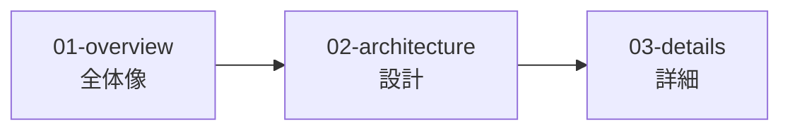

# ドキュメントインデックス

> Status: Active
> 最終更新: 2026-01-28

本ドキュメントは、WebSSHプロジェクトの設計ドキュメント全体のナビゲーションを提供する。

---

## ドキュメント構造

| レベル | 目的 | 対象読者 |
|--------|------|----------|
| **01-overview** | 何を作るか、なぜ作るか | 初見・思い出し用 |
| **02-architecture** | どう構成するか | 設計理解 |
| **03-details** | 具体的な仕様 | 実装時参照 |

---

## ドキュメント一覧

### 01 - Overview（全体像）

| ドキュメント | 説明 |
|--------------|------|
| [summary.md](./01-overview/summary.md) | プロジェクト概要（1枚で全体把握） |
| [goals.md](./01-overview/goals.md) | 目的・解決する課題 |
| [scope.md](./01-overview/scope.md) | スコープ・対象外 |

### 02 - Architecture（設計）

| ドキュメント | 説明 |
|--------------|------|
| [context.md](./02-architecture/context.md) | システム境界・外部連携 |
| [structure.md](./02-architecture/structure.md) | 主要コンポーネント構成 |
| [tech-stack.md](./02-architecture/tech-stack.md) | 技術スタック |

### 03 - Details（詳細）

| ドキュメント | 説明 |
|--------------|------|
| [ui.md](./03-details/ui.md) | UI設計（画面一覧・遷移） |
| [api.md](./03-details/api.md) | REST API + WebSocket API設計 |
| [flows.md](./03-details/flows.md) | SSH接続・コマンド送信フロー |

---

## 読み方ガイド

### 初めて読む場合

1. [summary.md](./01-overview/summary.md) - プロジェクト概要を把握
2. [goals.md](./01-overview/goals.md) - 目的を理解
3. [context.md](./02-architecture/context.md) - システム境界を確認

### 設計を理解したい場合

1. [structure.md](./02-architecture/structure.md) - コンポーネント構成
2. [tech-stack.md](./02-architecture/tech-stack.md) - 技術選定理由
3. [flows.md](./03-details/flows.md) - 処理フロー

### 実装時に参照する場合

1. [api.md](./03-details/api.md) - API仕様
2. [ui.md](./03-details/ui.md) - 画面設計
3. [flows.md](./03-details/flows.md) - 処理フロー
