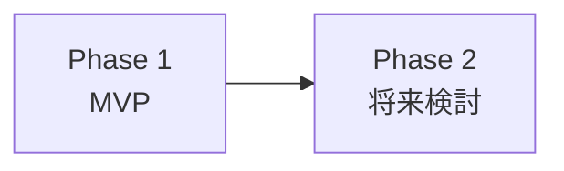

---
depends_on:
  - ./goals.md
tags: [overview, scope, phases]
ai_summary: "Hotateの対象範囲・対象外・フェーズ分割（MVP/将来）・前提条件・制約を定義"
---

# スコープ・対象外

> Status: Draft
> 最終更新: 2026-01-28

本ドキュメントは、Hotateプロジェクトのスコープ（範囲）を明確にする。

---

## スコープ定義

### 対象範囲

| カテゴリ | 対象 | 説明 |
|----------|------|------|
| 機能 | SSH接続 | パスワード認証・SSH Key認証による接続 |
| 機能 | ターミナル表示 | xterm.jsによる出力表示 |
| 機能 | IME対応入力 | compositionイベントによる日本語入力 |
| 機能 | 特殊キー送信 | Tab, Ctrl+C, Ctrl+D, Esc等のツールバー |
| 機能 | ホスト管理CRUD | JSON永続化によるホスト情報の登録・編集・削除 |
| 機能 | PWA | Service Workerによるオフラインキャッシュ、ホーム画面追加 |
| ユーザー | 個人開発者 | Basic認証による単一ユーザーアクセス |
| プラットフォーム | モバイルブラウザ | iOS Safari, Android Chromeを主対象 |
| プラットフォーム | デスクトップブラウザ | Chrome, Firefox（副次対象） |
| インフラ | Docker + Traefik | サーバーへのコンテナデプロイ |

### 対象外

| カテゴリ | 対象外 | 理由 |
|----------|--------|------|
| 機能 | ファイル転送（SCP/SFTP） | ターミナル操作に集中する |
| 機能 | マルチユーザー管理 | 個人利用のため不要 |
| 機能 | SSH鍵生成UI | 既存鍵のマウントで対応 |
| 機能 | セッション永続化 | 初期スコープでは不要 |
| プラットフォーム | ネイティブアプリ | PWAで十分 |
| データベース | RDB/NoSQL | JSONファイル永続化で対応 |

---

## フェーズ分け

### Phase 1: MVP

| 機能 | 説明 |
|------|------|
| Express + Basic認証 | 静的ファイル配信とAPI認証 |
| ホストCRUD | JSONベースのホスト情報管理API |
| 接続画面 | ホスト一覧表示・選択・モーダルCRUD |
| WebSocket + SSHブリッジ | ws ↔ ssh2 ストリーム変換 |
| xterm.jsターミナル | CDN読み込みによるターミナル表示 |
| IME対応入力バー | compositionイベントによる日本語入力対応 |
| 特殊キーツールバー | Tab, Ctrl+C等のソフトウェアキー |
| tmux タブ管理 | tmux attach自動検出、ウィンドウタブ表示・切替、デタッチ |
| PWA対応 | manifest.json + Service Worker |
| Docker化 | node:22-alpine + docker-compose + Traefik |

### Phase 2以降（将来検討）

| 機能 | 説明 |
|------|------|
| セッション再接続 | 切断後の自動再接続 |
| 複数タブ | 同時に複数SSHセッションを表示 |
| テーマ切替 | ターミナルカラースキーム変更 |
| WebAuthn認証 | Basic認証の代替としてパスキー対応 |

---

## 前提条件

| 前提 | 説明 |
|------|------|
| Node.js 22+ | crypto.randomUUID()、--watchフラグを使用 |
| Docker環境 | サーバーにDockerとTraefikが稼働済み |
| Tailscale VPN | サーバーへのアクセス経路が確保済み |
| TLS終端 | TraefikがTLSを処理（Basic認証の安全性確保） |

---

## 制約事項

| 制約 | 種別 | 説明 |
|------|------|------|
| ビルドステップなし | 技術 | Vanilla JS + CDNのみ。npm buildやバンドラーは使用しない |
| 外部DB不使用 | 技術 | ホスト情報はJSONファイルで永続化する |
| Basic認証のみ | セキュリティ | TLS必須。将来的にWebAuthnへの置き換えを検討 |
| SSH Key配置 | 運用 | Dockerコンテナ内からアクセスできるパスに鍵をバインドマウントする必要がある |

---

## 関連ドキュメント

- [summary.md](./summary.md) - プロジェクト概要
- [goals.md](./goals.md) - 目的・解決する課題
