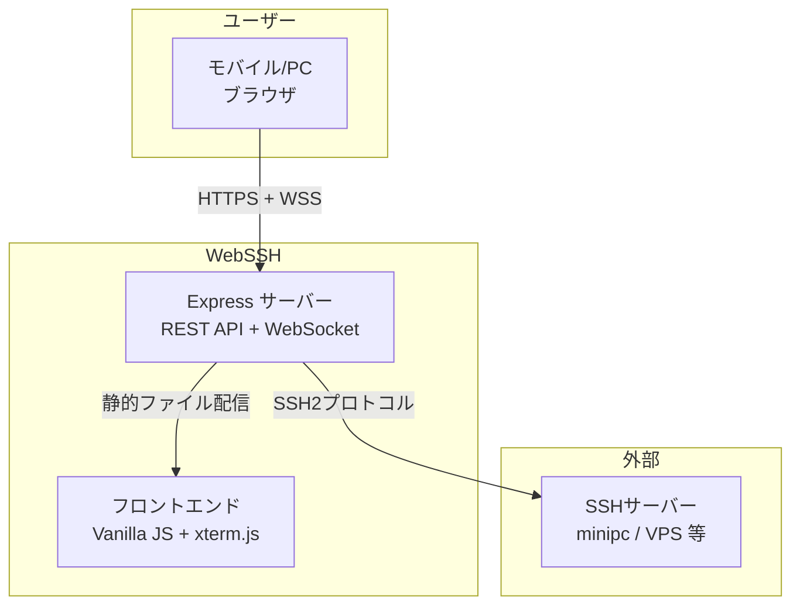

# プロジェクト概要

> Status: Draft
> 最終更新: 2026-01-28

本ドキュメントは、WebSSHプロジェクト全体を1枚で把握するための概要を記載する。

---

## 一言で言うと

WebSSHは、モバイル端末からSSHサーバーに接続するためのIME対応ブラウザターミナルを提供するWebアプリケーションである。

---

## 背景

| 項目 | 内容 |
|------|------|
| 現状の課題 | モバイル端末のSSHクライアントは日本語IME入力との相性が悪く、VPSやホームサーバーへの緊急操作が困難 |
| 解決アプローチ | ブラウザ上でxterm.jsターミナルとIME対応入力バーを組み合わせ、PWAとしてモバイルから快適にSSH操作できる環境を構築する |

---

## 主要機能

| 機能 | 説明 |
|------|------|
| SSH接続管理 | 複数ホストの保存・選択。パスワード/SSH Key認証に対応 |
| ブラウザターミナル | xterm.jsによるフル機能ターミナル表示 |
| IME対応入力バー | compositionイベントでIME状態を追跡し、日本語入力を正確にSSHストリームへ送信 |
| 特殊キーツールバー | Tab, Ctrl+C, Ctrl+D等のソフトウェアキーをタップで送信 |
| PWA対応 | ホーム画面追加、オフライン時の静的リソースキャッシュ |

---

## 対象ユーザー

| ユーザー種別 | 説明 | 主な利用シーン |
|--------------|------|----------------|
| 個人開発者（自分） | VPS・ホームサーバーを運用する開発者 | 外出先からサーバー確認・緊急対応 |

---

## システム概観

---

## 関連ドキュメント

- [目的・解決する課題](./goals.md) - 課題一覧と成功基準の定義
- [スコープ・対象外](./scope.md) - 対象範囲とフェーズ分割
- [システム境界・外部連携](../02-architecture/context.md) - システム境界と外部システム定義
