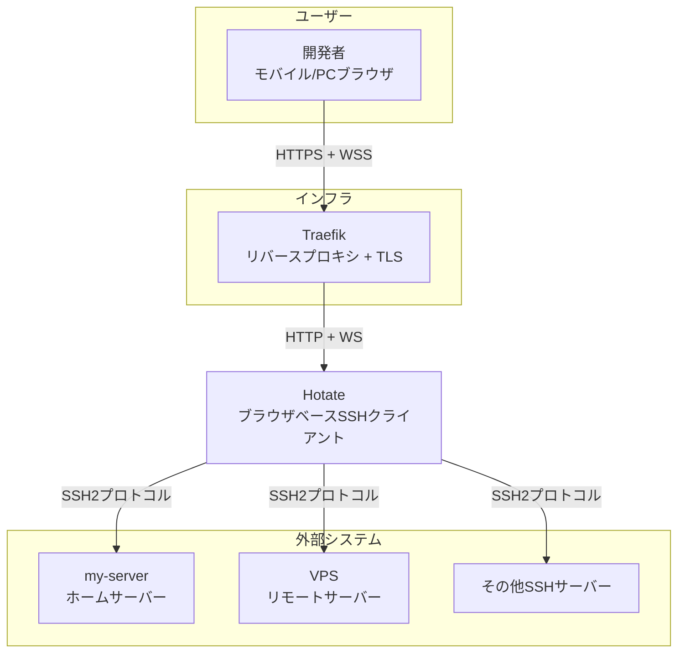

---
depends_on:
  - ../01-overview/summary.md
tags: [architecture, c4, context, boundary]
ai_summary: "Hotateのシステム境界と外部連携（ブラウザ→Expressサーバー→SSHサーバー）をC4 Context図で定義"
---

# システム境界・外部連携

> Status: Draft
> 最終更新: 2026-01-28

本ドキュメントは、Hotateのシステム境界と外部システムとの連携を定義する（C4 Context相当）。

---

## システムコンテキスト図

---

## アクター定義

| アクター | 種別 | 説明 | 主な操作 |
|----------|------|------|----------|
| 開発者（自分） | 人間 | VPS・ホームサーバーを運用する個人開発者 | ホスト管理、SSH接続、コマンド実行 |
| SSHサーバー | 外部システム | 接続先のLinuxサーバー | SSH接続の受付、コマンド実行結果の返却 |
| Traefik | インフラ | リバースプロキシ | TLS終端、WebSocketプロキシ |

---

## 外部システム連携

### SSHサーバー

| 項目 | 内容 |
|------|------|
| 概要 | SSH接続先のLinuxサーバー |
| 連携方式 | SSH2プロトコル（ssh2ライブラリ経由） |
| 連携データ | 認証情報（パスワード/秘密鍵）、シェルストリーム（stdin/stdout） |
| 連携頻度 | リアルタイム（常時双方向ストリーム） |
| 依存度 | 必須 |

### Traefik

| 項目 | 内容 |
|------|------|
| 概要 | TLS終端とリバースプロキシ |
| 連携方式 | HTTP/WebSocketプロキシ |
| 連携データ | HTTPリクエスト/レスポンス、WebSocketフレーム |
| 連携頻度 | リアルタイム |
| 依存度 | 必須（本番環境）。開発環境ではTraefikなしで直接アクセス |

---

## システム境界

### 内部（本システムの責務）

| 責務 | 説明 |
|------|------|
| ホスト情報の管理 | 接続先情報のCRUD（JSONファイル永続化） |
| 認証ゲートウェイ | Basic認証によるアプリケーションアクセス制御 |
| SSH接続の確立 | ssh2ライブラリによる接続・認証 |
| ストリーム変換 | WebSocket ↔ SSHストリーム間のデータブリッジ |
| ターミナルUI | xterm.jsによる表示 + IME対応入力バー |

### 外部（本システムの責務外）

| 項目 | 担当 | 説明 |
|------|------|------|
| TLS証明書管理 | Traefik (Let's Encrypt) | HTTPS/WSS通信の暗号化 |
| SSHサーバーの運用 | 各サーバー管理者 | sshd設定、ユーザー管理、鍵管理 |
| ネットワーク接続 | Tailscale / ISP | VPNやネットワーク経路の確保 |
| DNS解決 | DNSプロバイダー | ドメイン名の解決 |

---

## 関連ドキュメント

- [summary.md](../01-overview/summary.md) - プロジェクト概要
- [structure.md](./structure.md) - 主要コンポーネント構成
