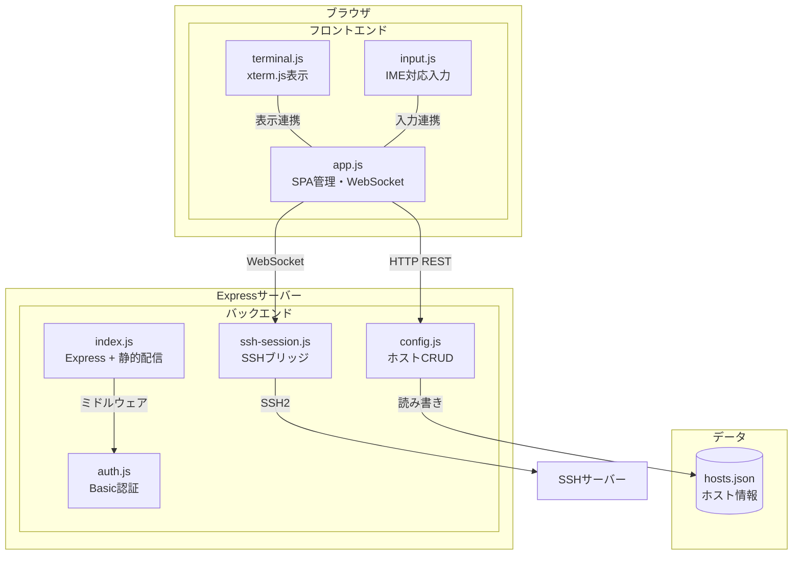

---
depends_on:
  - ./context.md
tags: [architecture, c4, container, components]
ai_summary: "Hotateの主要コンポーネント（フロントエンド3モジュール + バックエンド4モジュール）の構成・責務・通信方式を定義"
---

# 主要コンポーネント構成

> Status: Draft
> 最終更新: 2026-01-28

本ドキュメントは、Hotateの主要コンポーネントとその関係を定義する（C4 Container相当）。

---

## コンポーネント構成図



---

## コンポーネント一覧

| コンポーネント | 種別 | 責務 | 技術 |
|----------------|------|------|------|
| app.js | フロントエンド | SPA画面遷移、WebSocket管理、状態管理 | Vanilla JS |
| terminal.js | フロントエンド | ターミナル出力の表示、リサイズ追従 | xterm.js (CDN) |
| input.js | フロントエンド | IME対応入力、特殊キーマッピング | Vanilla JS |
| index.js | バックエンド | Expressサーバー起動、静的ファイル配信、ルーティング | Express |
| auth.js | バックエンド | Basic認証ミドルウェア | Express middleware |
| config.js | バックエンド | ホスト情報のCRUD操作 | Node.js fs |
| ssh-session.js | バックエンド | WebSocket ↔ SSH2ストリーム変換 | ws, ssh2 |

---

## コンポーネント詳細

### app.js

| 項目 | 内容 |
|------|------|
| 責務 | SPA画面遷移（接続画面 ↔ ターミナル画面）、WebSocket接続管理、接続状態管理、tmuxタブ管理 |
| 技術 | Vanilla JS（DOM display切替によるSPA） |
| 入力 | ユーザー操作（ホスト選択、接続/切断）、input.jsからの入力データ、tmux-attached/detachedイベント |
| 出力 | WebSocketメッセージ送信、terminal.jsへの表示指示、tmuxタブバーの描画 |
| 依存 | terminal.js, input.js |
| tmux関連 | tmuxPollTimer（3秒ポーリング）、queryTmuxWindows()、renderTmuxTabs()、selectTmuxWindow() |

### terminal.js

| 項目 | 内容 |
|------|------|
| 責務 | xterm.jsのターミナルインスタンス管理、FitAddonによるリサイズ追従、Base64デコード→表示 |
| 技術 | xterm.js + FitAddon (CDN), disableStdin: true |
| 入力 | app.jsからのBase64エンコード済み出力データ |
| 出力 | 画面へのターミナル出力表示 |
| 依存 | xterm.js CDN |

### input.js

| 項目 | 内容 |
|------|------|
| 責務 | IME composition状態の追跡、特殊キーマッピング、Base64エンコード |
| 技術 | Vanilla JS（compositionstart/end イベント） |
| 入力 | ユーザーのキーボード入力、特殊キーボタンのタップ |
| 出力 | Base64エンコード済み入力データをapp.jsへ |
| 依存 | なし |

### index.js

| 項目 | 内容 |
|------|------|
| 責務 | Expressサーバーの起動、静的ファイル配信（public/）、APIルーティング |
| 技術 | Express, ws |
| 入力 | HTTP/WebSocketリクエスト |
| 出力 | 静的ファイル、APIレスポンス、WebSocketメッセージ |
| 依存 | auth.js, config.js, ssh-session.js |

### auth.js

| 項目 | 内容 |
|------|------|
| 責務 | Basic認証によるアクセス制御 |
| 技術 | Express middleware |
| 入力 | Authorizationヘッダー |
| 出力 | 認証成功→next() / 認証失敗→401レスポンス |
| 依存 | 環境変数（HOTATE_USER, HOTATE_PASS） |

### config.js

| 項目 | 内容 |
|------|------|
| 責務 | data/hosts.jsonの読み書き、ホスト情報のCRUD操作 |
| 技術 | Node.js fs/promises, crypto.randomUUID() |
| 入力 | REST APIリクエスト（GET/POST/PUT/DELETE） |
| 出力 | ホスト情報のJSONレスポンス |
| 依存 | data/hosts.json |

### ssh-session.js

| 項目 | 内容 |
|------|------|
| 責務 | WebSocketとSSH2ストリーム間の双方向データ変換、tmuxクエリ実行、alternate screen buffer検出 |
| 技術 | ws, ssh2 |
| 入力 | WebSocketメッセージ（type: input / resize / tmux-query） |
| 出力 | WebSocketメッセージ（type: output / error / exit / tmux-result / tmux-attached / tmux-detached） |
| 依存 | SSHサーバー |
| tmux関連 | tmux-queryはconn.exec()で実行（PTYとは別チャネル）。alternate screen bufferシーケンス検出でtmux-attached/tmux-detachedを通知 |

---

## コンポーネント間通信

| 送信元 | 送信先 | プロトコル | 内容 |
|--------|--------|------------|------|
| ブラウザ | Express | HTTP GET | 静的ファイル取得 |
| ブラウザ | Express | HTTP REST | ホストCRUD API |
| ブラウザ | Express | WebSocket | SSH入力（Base64）、ターミナルリサイズ |
| Express | ブラウザ | WebSocket | SSH出力（Base64）、エラー通知、終了通知 |
| Express | SSHサーバー | SSH2 | シェルストリーム（stdin/stdout） |

---

## ディレクトリ構成

```
hotate/
├── server/
│   ├── index.js          # Expressサーバー + WebSocket
│   ├── auth.js           # Basic認証ミドルウェア
│   ├── config.js         # ホストCRUD（hosts.json）
│   └── ssh-session.js    # WebSocket ↔ SSH2ブリッジ
├── public/
│   ├── index.html        # SPA HTML
│   ├── css/
│   │   └── style.css     # Vanilla CSS（確定デザイン準拠）
│   ├── js/
│   │   ├── app.js        # SPA管理・WebSocket
│   │   ├── terminal.js   # xterm.js
│   │   └── input.js      # IME対応入力
│   ├── manifest.json     # PWAマニフェスト
│   └── sw.js             # Service Worker
├── data/
│   └── hosts.json        # ホスト情報永続化
├── docs/                 # 設計ドキュメント
├── package.json
├── .env.example
├── .gitignore
├── Dockerfile
├── docker-compose.yml
└── CLAUDE.md
```

---

## 関連ドキュメント

- [システム境界・外部連携](./context.md) - C4 Context図と外部システム定義
- [技術スタック](./tech-stack.md) - 技術選定と選定理由
- [API設計](../03-details/api.md) - APIエンドポイント仕様
- [UI設計](../03-details/ui.md) - 画面一覧と画面遷移
- [主要フロー](../03-details/flows.md) - SSH接続・コマンド送信フロー
