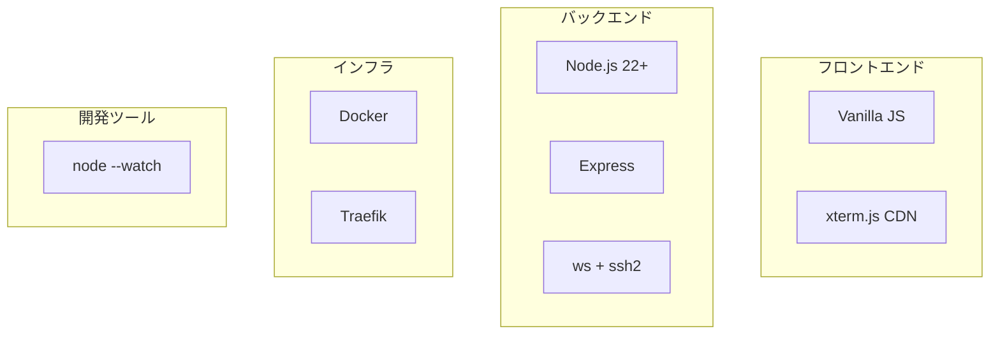

---
depends_on:
  - ./structure.md
tags: [architecture, technology, stack]
ai_summary: "WebSSHの技術選定一覧（Express/ws/ssh2/xterm.js）と選定理由・代替案を定義"
---

# 技術スタック

> Status: Draft
> 最終更新: 2026-01-28

本ドキュメントは、WebSSHで使用する技術スタックとその選定理由を記載する。

---

## 技術スタック概要

---

## 技術スタック一覧

### 言語・フレームワーク

| カテゴリ | 技術 | バージョン | 用途 |
|----------|------|------------|------|
| ランタイム | Node.js | 22+ | サーバー実行環境 |
| 言語 | JavaScript (ES2022+) | - | フロントエンド・バックエンド共通 |
| Webフレームワーク | Express | 4.x | HTTP API・静的配信 |
| WebSocket | ws | 8.x | WebSocket サーバー |
| SSH | ssh2 | 1.x | SSH2プロトコル実装 |
| ターミナル | xterm.js | 5.x (CDN) | ブラウザ内ターミナル表示 |
| ID生成 | crypto.randomUUID() | Node.js標準 | ホストID生成 |
| UUID | uuid | 9.x | WebSocketセッションID生成 |

### データストレージ

| 技術 | 用途 |
|------|------|
| JSONファイル (data/hosts.json) | ホスト接続情報の永続化 |

### インフラ

| 技術 | 用途 |
|------|------|
| Docker (node:22-alpine) | アプリケーションコンテナ |
| docker-compose | コンテナオーケストレーション |
| Traefik | リバースプロキシ、TLS終端、WebSocketプロキシ |

### 開発ツール

| カテゴリ | 技術 | 用途 |
|----------|------|------|
| 開発サーバー | node --watch | ファイル変更時の自動再起動 |
| パッケージ管理 | npm | 依存パッケージ管理 |

---

## 技術選定理由

### Vanilla JS（ビルドステップなし）

| 項目 | 内容 |
|------|------|
| 選定理由 | ビルドステップを排除し、ファイル編集→即反映の開発体験を得るため |
| 代替候補 | React + Vite, Svelte, Lit |
| 不採用理由 | コンポーネント数が少なく（2画面）、フレームワークのオーバーヘッドが利点を上回る |

### xterm.js (CDN)

| 項目 | 内容 |
|------|------|
| 選定理由 | ブラウザ内ターミナルのデファクトスタンダード。npmビルドなしでCDN読み込みが可能 |
| 代替候補 | hterm, 自作Canvas描画 |
| 不採用理由 | htermはChrome向け最適化で汎用性が低い。自作はコスト過大 |

### Express

| 項目 | 内容 |
|------|------|
| 選定理由 | シンプルで軽量。静的ファイル配信とREST APIに最小限の機能を提供する |
| 代替候補 | Fastify, Hono (Node.js) |
| 不採用理由 | このプロジェクトの規模ではExpressで十分。Fastifyのパフォーマンス優位は不要 |

### ws（WebSocketライブラリ）

| 項目 | 内容 |
|------|------|
| 選定理由 | Node.js向けWebSocketの標準的実装。Socket.ioと異なりプロトコル準拠で軽量 |
| 代替候補 | Socket.io |
| 不採用理由 | Socket.ioの自動再接続や名前空間機能は不要。素のWebSocketで十分 |

### Base64転送統一

| 項目 | 内容 |
|------|------|
| 選定理由 | UTF-8のマルチバイト文字がWebSocketフレーム境界で分割される問題を回避する |
| 代替候補 | UTF-8テキストそのまま, バイナリフレーム |
| 不採用理由 | UTF-8分割問題の処理が煩雑。Base64なら安全にASCII文字列として転送可能 |

### JSONファイル永続化

| 項目 | 内容 |
|------|------|
| 選定理由 | ホスト情報は数件〜数十件の規模で、DBを導入するほどの要件がない |
| 代替候補 | SQLite, LevelDB |
| 不採用理由 | 追加の依存なしにNode.js標準のfsで実装可能。docker volumeで永続化する |

---

## バージョン管理方針

| 項目 | 方針 |
|------|------|
| Node.js | LTSに追従。node:22-alpineベースイメージで固定 |
| npmパッケージ | セキュリティパッチは即時適用 |
| xterm.js CDN | メジャーバージョン固定（5.x）。マイナー更新は随時 |

---

## 関連ドキュメント

- [structure.md](./structure.md) - 主要コンポーネント構成
