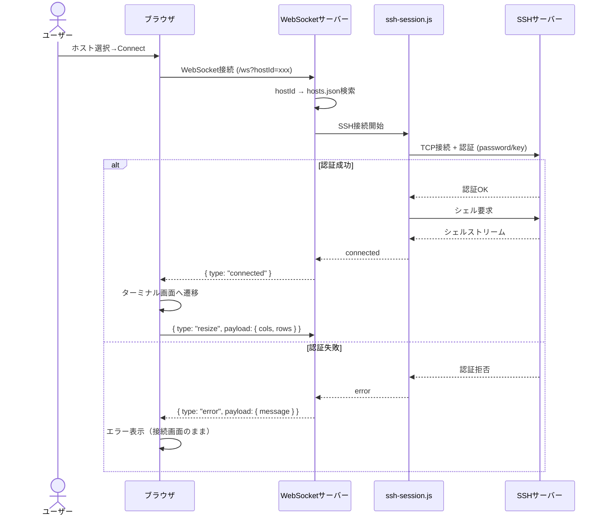
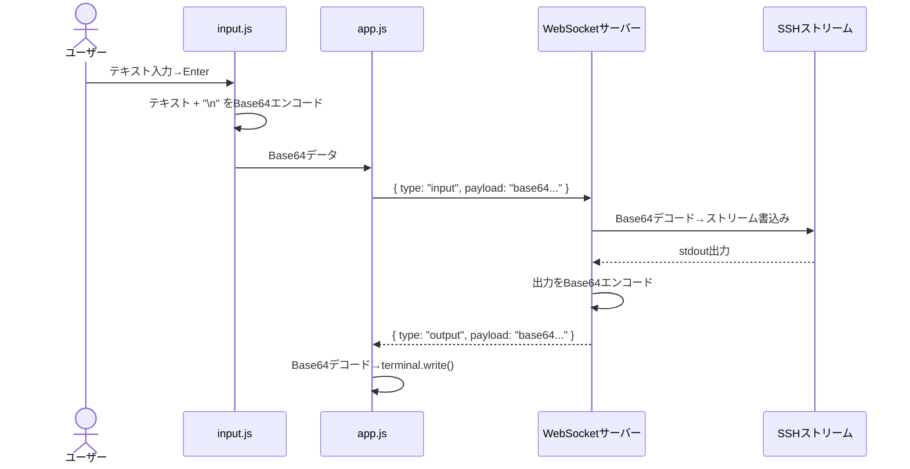
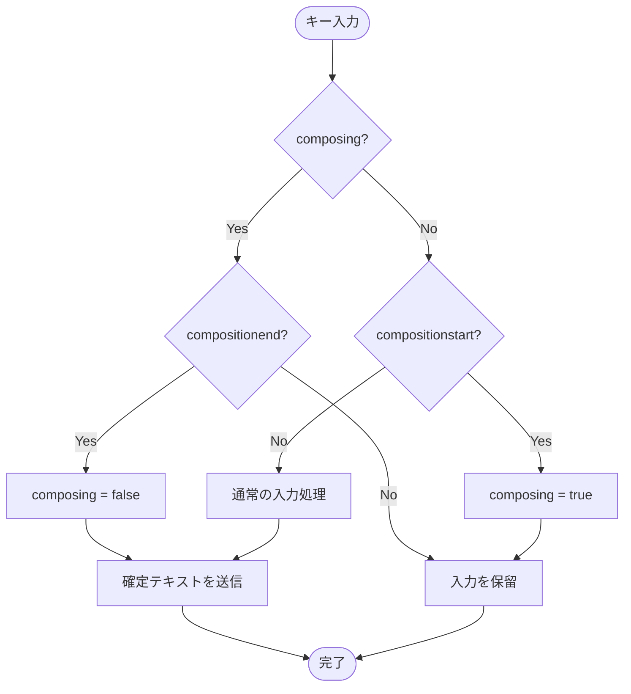
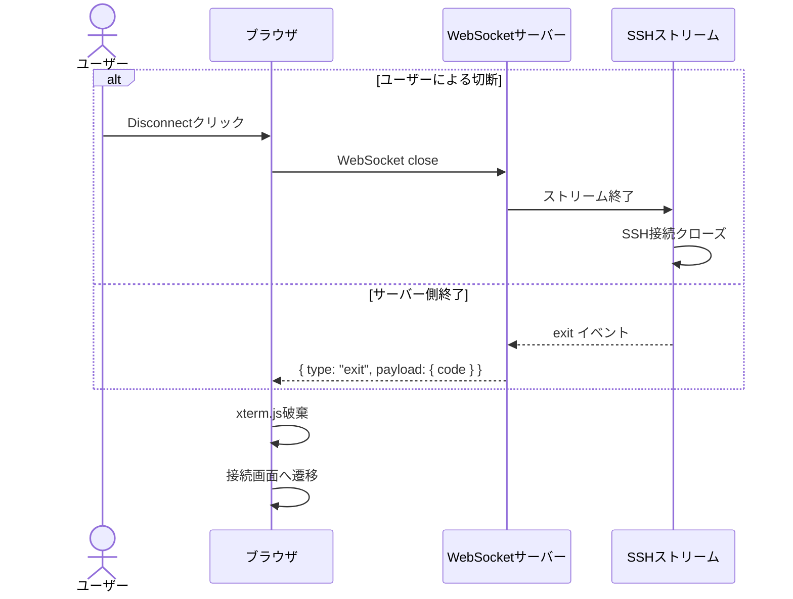
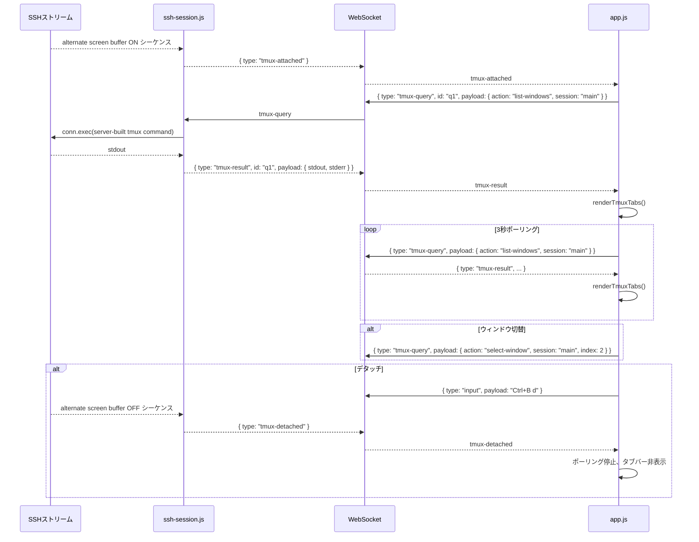

---
depends_on:
  - ../02-architecture/structure.md
tags: [details, flows, sequence, ssh]
ai_summary: "Hotateの主要フロー（SSH接続確立・コマンド送信・IME入力・切断）のシーケンス図と処理ステップを定義"
---

# 主要フロー

> Status: Draft
> 最終更新: 2026-01-28

本ドキュメントは、Hotateの主要な処理フローを定義する。

---

## フロー一覧

| フローID | フロー名 | 説明 |
|----------|----------|------|
| F001 | SSH接続確立 | ホスト選択→WebSocket接続→SSH認証→シェル取得 |
| F002 | コマンド送信 | 入力バーからの文字列→Base64→WebSocket→SSH |
| F003 | IME入力 | 日本語入力のcomposition追跡→確定後に送信 |
| F004 | 切断 | Disconnectボタン→SSH/WebSocket切断→画面遷移 |
| F005 | tmux タブ管理 | tmux attach検出→ウィンドウタブ表示→切替・デタッチ操作 |

---

## フロー詳細

### F001: SSH接続確立

| 項目 | 内容 |
|------|------|
| 概要 | ユーザーがホストを選択しConnectをクリックしてから、SSHシェルが確立されるまでのフロー |
| トリガー | Connectボタンのクリック |
| アクター | ユーザー（ブラウザ） |
| 前提条件 | Basic認証済み、ホストが1つ以上登録済み |
| 事後条件 | ターミナル画面が表示され、SSHシェルからの出力が表示される |

#### シーケンス図

#### 処理ステップ

| # | 処理 | 担当 | 説明 |
|---|------|------|------|
| 1 | ホスト選択 | ブラウザ | ホストリストから接続先を選択 |
| 2 | WebSocket接続 | ブラウザ | hostIdをクエリパラメータに含めて接続 |
| 3 | ホスト情報取得 | サーバー | hostIdでhosts.jsonを検索 |
| 4 | SSH接続 | ssh-session.js | ssh2で接続先に接続し認証を実行 |
| 5 | シェル取得 | ssh-session.js | shell()でPTYを取得 |
| 6 | 接続通知 | サーバー | connectedメッセージをクライアントへ送信 |
| 7 | 画面遷移 | ブラウザ | ターミナル画面を表示しxterm.jsを初期化 |
| 8 | リサイズ通知 | ブラウザ | ターミナルサイズをサーバーに送信 |

#### エラーケース

| エラー | 条件 | 対応 |
|--------|------|------|
| ホスト未登録 | hostIdがhosts.jsonに存在しない | errorメッセージを返し接続画面のまま |
| SSH認証失敗 | パスワード不一致 or 鍵が無効 | errorメッセージを返し接続画面のまま |
| 接続タイムアウト | SSHサーバーが応答しない | タイムアウトエラーを返す |
| 鍵ファイル不在 | keyPathのファイルが存在しない | errorメッセージを返す |

---

### F002: コマンド送信

| 項目 | 内容 |
|------|------|
| 概要 | ユーザーが入力バーにコマンドを入力し、SSHサーバーで実行されるまでのフロー |
| トリガー | Enterキー押下 or 送信ボタンクリック |
| アクター | ユーザー |
| 前提条件 | SSH接続が確立済み |
| 事後条件 | コマンドがSSHサーバーで実行され、結果がターミナルに表示される |

#### シーケンス図

#### 処理ステップ

| # | 処理 | 担当 | 説明 |
|---|------|------|------|
| 1 | テキスト入力 | input.js | 入力バーでユーザーが文字を入力 |
| 2 | Enter検出 | input.js | Enterキーまたは送信ボタンで発火 |
| 3 | Base64エンコード | input.js | テキスト + `\n` をBase64に変換 |
| 4 | WebSocket送信 | app.js | inputメッセージとして送信 |
| 5 | デコード→SSH書込 | ssh-session.js | Base64をデコードしストリームに書き込み |
| 6 | 出力取得 | ssh-session.js | stdoutからデータを受信 |
| 7 | Base64エンコード | ssh-session.js | 出力をBase64に変換 |
| 8 | クライアント表示 | app.js | デコードしてterminal.write()で表示 |

---

### F003: IME入力

| 項目 | 内容 |
|------|------|
| 概要 | 日本語IMEによる変換入力で、変換確定後にのみデータを送信するフロー |
| トリガー | IMEによる日本語入力開始 |
| アクター | ユーザー |
| 前提条件 | SSH接続が確立済み |
| 事後条件 | 変換確定済みテキストのみがSSHに送信される |

#### フローチャート

#### 処理ステップ

| # | 処理 | 担当 | 説明 |
|---|------|------|------|
| 1 | compositionstart | input.js | IME変換開始を検知、composingフラグをtrueに設定 |
| 2 | input中の入力 | input.js | composing=trueの間は入力を保留（送信しない） |
| 3 | compositionend | input.js | 変換確定を検知、composingフラグをfalseに設定 |
| 4 | 確定テキスト取得 | input.js | event.dataから確定済みテキストを取得 |
| 5 | Base64→送信 | input.js → app.js | F002と同じフローでSSHに送信 |

#### エラーケース

| エラー | 条件 | 対応 |
|--------|------|------|
| Safari二重発火 | compositionend後にinputイベントが再発火する | compositionend直後のinputイベントをスキップする |

---

### F004: 切断

| 項目 | 内容 |
|------|------|
| 概要 | ユーザー操作またはサーバー側終了によるSSH接続の切断フロー |
| トリガー | Disconnectボタン or SSH接続のサーバー側終了 |
| アクター | ユーザー or SSHサーバー |
| 前提条件 | SSH接続が確立済み |
| 事後条件 | WebSocket/SSH接続がクローズされ、接続画面に戻る |

#### シーケンス図

#### 処理ステップ

| # | 処理 | 担当 | 説明 |
|---|------|------|------|
| 1 | 切断トリガー | ブラウザ or SSH | Disconnectクリック or exitイベント |
| 2 | WebSocketクローズ | app.js | WebSocket接続を閉じる |
| 3 | SSHクローズ | ssh-session.js | SSHストリーム・接続をクローズ |
| 4 | リソース解放 | ブラウザ | xterm.jsインスタンスを破棄 |
| 5 | 画面遷移 | app.js | 接続画面を再表示 |

---

### F005: tmux タブ管理

| 項目 | 内容 |
|------|------|
| 概要 | SSH出力のalternate screen bufferシーケンスを検出してtmux attach状態を認識し、ウィンドウ一覧をタブバーで表示・操作するフロー |
| トリガー | SSH出力にalternate screen bufferシーケンスが検出される |
| アクター | ssh-session.js（検出）、app.js（UI管理） |
| 前提条件 | SSH接続が確立済み |
| 事後条件 | tmuxウィンドウのタブバーが表示され、タップで切替・デタッチが可能 |

#### シーケンス図

#### 処理ステップ

| # | 処理 | 担当 | 説明 |
|---|------|------|------|
| 1 | attach検出 | ssh-session.js | SSH出力のalternate screen bufferシーケンスを検出し、tmux-attachedを送信 |
| 2 | セッション確認 | app.js | tmux-queryでlist-sessionsを実行し、tmuxセッションの存在を確認 |
| 3 | ウィンドウ一覧取得 | app.js | tmux-queryでlist-windowsを実行 |
| 4 | タブバー描画 | app.js | renderTmuxTabs()でウィンドウタブを`#tmux-tabs`に描画 |
| 5 | ポーリング開始 | app.js | tmuxPollTimerで3秒ごとにウィンドウ一覧を再取得・再描画 |
| 6 | ウィンドウ切替 | app.js | selectTmuxWindow()でtmux-query `select-window` を送信 |
| 7 | デタッチ | app.js | PTY経由でCtrl+B d を送信 |
| 8 | detach検出 | ssh-session.js | alternate screen buffer OFFシーケンスを検出し、tmux-detachedを送信 |
| 9 | クリーンアップ | app.js | ポーリング停止、タブバー非表示 |

#### エラーケース

| エラー | 条件 | 対応 |
|--------|------|------|
| tmux未インストール | tmux-queryでcommand not found | タブバーを表示せずサイレントに無視 |
| セッションなし | list-sessionsが空 | タブバーを表示しない |
| クエリタイムアウト | execチャネルが応答しない | ポーリングを継続し次回リトライ |

---

## 関連ドキュメント

- [api.md](./api.md) - API設計
- [ui.md](./ui.md) - UI設計
