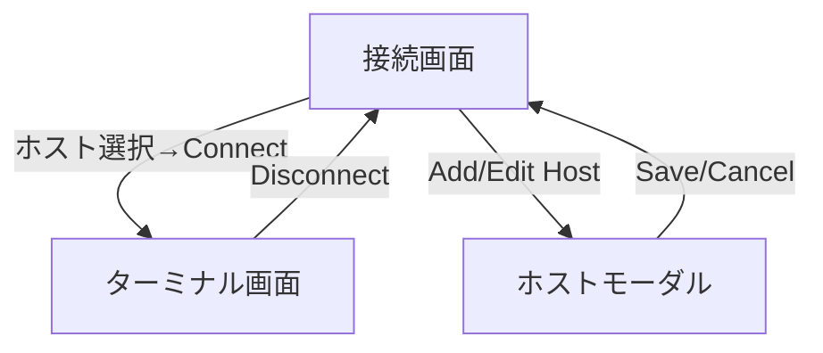

---
depends_on:
  - ../02-architecture/structure.md
  - ./flows.md
tags: [details, ui, screens, interactions]
ai_summary: "Hotateの画面一覧（接続画面・ターミナル画面）・画面遷移・UI要素・レスポンシブ対応を定義"
---

# UI設計

> Status: Draft
> 最終更新: 2026-01-28

本ドキュメントは、HotateのUI設計を定義する。確定デザイン（ssh_connect_2_2, terminal_sc_2_1, mobile_term_2_1）に基づく。

---

## 画面一覧

| 画面ID | 画面名 | パス | 説明 |
|--------|--------|------|------|
| S001 | 接続画面 | `/` (初期表示) | ホスト一覧、接続先選択、ホストCRUDモーダル |
| S002 | ターミナル画面 | `/` (DOM切替) | xterm.jsターミナル、入力バー、特殊キーツールバー |

---

## 画面遷移図

---

## デザインシステム

### カラーパレット

| 用途 | 色 | コード |
|------|-----|--------|
| 背景（メイン） | ダークネイビー | `#0a0e14` |
| 背景（ターミナル） | ほぼ黒 | `#020408` |
| 背景（セカンダリ） | ダークグレー | `#141820` |
| ボーダー | グレー | `#2a3040` |
| アクセント | ブルー | `#3b82f6` |
| テキスト（プライマリ） | ライトグレー | `#e6edf3` |
| テキスト（セカンダリ） | グレー | `#6e7681` |
| 成功 | グリーン | `#3fb950` |
| エラー | レッド | `#f85149` |

### フォント

| 用途 | フォント | ウェイト |
|------|----------|----------|
| ターミナル・コード | JetBrains Mono | 400-700 |
| UIテキスト | Inter | 400-600 |

---

## 画面詳細

### S001: 接続画面

| 項目 | 内容 |
|------|------|
| パス | `/`（初期表示状態） |
| 目的 | 保存済みホストの選択・接続、ホスト情報の管理 |
| アクセス権 | Basic認証済みユーザー |
| 参照デザイン | `hotate___ssh_connect_2_2.html` |

#### 構成要素

| 要素 | 種別 | 説明 |
|------|------|------|
| ターミナルヘッダー | 装飾 | ウィンドウコントロール風ドット3つ + タイトル「hotate -- connect」 |
| ホスト一覧 | リスト | 保存済みホストを表示。ホスト名、認証方式バッジ、編集ボタン |
| 認証情報表示 | 表示 | 選択ホストの認証方式に応じたパスワード入力 or SSH Keyパス表示 |
| Connectボタン | ボタン | 選択ホストへのSSH接続を開始（グラデーションブルー） |
| Add Hostボタン | ボタン | ホスト追加モーダルを開く |

#### ユーザー操作

| 操作 | 結果 |
|------|------|
| ホストアイテムをクリック | そのホストを選択状態にし、認証情報を表示 |
| 編集ボタンをクリック | 編集モーダルを開く |
| Add Hostをクリック | 新規追加モーダルを開く |
| Connectをクリック | SSH接続開始→成功時にターミナル画面へ遷移 |

### M001: ホストモーダル

| 項目 | 内容 |
|------|------|
| 目的 | ホスト情報の新規登録・編集・削除 |
| 表示方式 | オーバーレイモーダル（backdrop-filter: blur） |

#### 構成要素

| 要素 | 種別 | 説明 |
|------|------|------|
| Name | テキスト入力 | ホストの表示名 |
| Host | テキスト入力 | ホスト名またはIPアドレス |
| Port | 数値入力 | ポート番号（デフォルト: 22） |
| Username | テキスト入力 | SSHユーザー名 |
| Auth方式トグル | トグルボタン | Password / SSH Key の切替 |
| Password | パスワード入力 | auth=passwordの場合に表示 |
| Key Path | テキスト入力 | auth=keyの場合に表示（秘密鍵パス） |
| Saveボタン | ボタン | ホスト情報を保存 |
| Deleteボタン | ボタン | 編集モード時のみ表示。ホストを削除 |
| Cancelボタン | ボタン | モーダルを閉じる |

### S002: ターミナル画面

| 項目 | 内容 |
|------|------|
| パス | `/`（ターミナル表示状態） |
| 目的 | SSH接続先でのコマンド実行・出力確認 |
| アクセス権 | Basic認証済み + SSH接続確立済み |
| 参照デザイン | `hotate___terminal_sc_2_1.html`, `hotate___mobile_term_2_1.html` |

#### 構成要素

| 要素 | 種別 | 説明 |
|------|------|------|
| 接続ヘッダー | ヘッダー | 接続状態ドット、ホスト名:ポート、Disconnectボタン |
| ターミナル出力 | xterm.js | SSHストリームの出力を表示（disableStdin: true） |
| 特殊キーツールバー | ボタン列 | Tab, Ctrl+C, Ctrl+D, 矢印上下, Esc, Ctrl+Z, Ctrl+L |
| 入力バー | テキスト入力 | `$` プロンプト + テキスト入力 + 送信ボタン |

#### ユーザー操作

| 操作 | 結果 |
|------|------|
| 入力バーにテキスト入力→Enter/送信 | Base64エンコードしてWebSocket送信 |
| 特殊キーボタンをタップ | 対応するエスケープシーケンスを送信 |
| Disconnectをクリック | SSH切断→接続画面へ遷移 |
| 日本語をIMEで入力 | composition確定後にのみ送信 |

---

## 共通コンポーネント

| コンポーネント | 説明 | 使用画面 |
|----------------|------|----------|
| グラデーションボタン | 135deg linear-gradient (#3b82f6 → #2563eb) | 接続画面、モーダル |
| ターミナルヘッダー | ウィンドウコントロール風3ドット + タイトル | 接続画面 |
| 認証バッジ | 認証方式を色分け表示（password: グレー、key: グリーン） | 接続画面 |

---

## レスポンシブ対応

| ブレークポイント | 幅 | 対応 |
|------------------|-----|------|
| モバイル | ~767px | 特殊キーを6個に削減、フォントサイズ縮小、入力バー・ツールバーをコンパクト化 |
| デスクトップ | 768px~ | 特殊キー8個表示、ユーザー名表示、接続画面は中央配置（max-width: md） |

---

## 関連ドキュメント

- [flows.md](./flows.md) - SSH接続・コマンド送信フロー
- [structure.md](../02-architecture/structure.md) - コンポーネント構成
